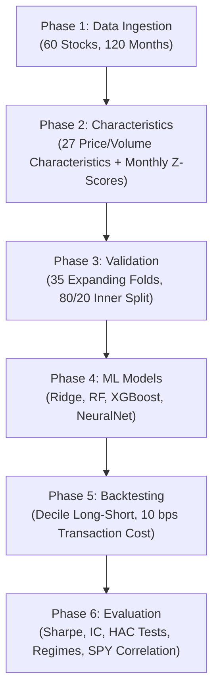

# Empirical Asset Pricing via Machine Learning

A research-oriented implementation of machine learning for cross-sectional stock return prediction, inspired by **Gu, Kelly & Xiu (2020), "Empirical Asset Pricing via Machine Learning."**

The project takes the core idea of combining financial characteristics with machine learning and builds an end-to-end workflow around it: historical market-data ingestion, characteristic construction, leakage-aware walk-forward validation, model comparison, long-short portfolio construction, transaction costs, statistical testing, regime analysis, and market-correlation analysis.

The goal of V1 was not to reproduce every detail of the original GKX dataset. Instead, it was to build a clean, reproducible financial-ML research pipeline using freely accessible market data and a practical set of price- and volume-derived characteristics.

---

## Executive Summary

| Model | Sharpe Ratio | IC (Spearman) | ICIR | Naive t-stat (p-val) | HAC t-stat (p-val) | Max Drawdown | Annualized Return | SPY Correlation |
| :--- | :---: | :---: | :---: | :---: | :---: | :---: | :---: | :---: |
| **Ridge Regression** | **0.6293** | 0.0370 | 0.1330 | 1.0747 (0.2901) | **0.9764** (0.3289) | **-29.42%** | **18.80%** | +0.0601 (p=0.7318) |
| **NeuralNet (Deep MLP)** | **0.3705** | 0.0290 | 0.1878 | 0.6328 (0.5311) | **0.5830** (0.5599) | -33.87% | +7.05% | -0.0333 (p=0.8494) |
| **RandomForest** | **0.2069** | 0.0019 | 0.0082 | 0.3533 (0.7260) | **0.3218** (0.7476) | -36.14% | +1.95% | +0.0489 (p=0.7802) |
| **XGBoost** | **0.0709** | **0.0417** | **0.2378** | 0.1211 (0.9043) | **0.1206** (0.9040) | -23.09% | -0.85% | -0.0886 (p=0.6127) |

### Key Findings

1. **Ridge Regression produced the strongest portfolio-level result.** It achieved the highest Sharpe ratio (**0.6293**) and the lowest maximum drawdown (**-29.42%**) among the four tested models. Its regularized linear structure produced a relatively stable cross-sectional signal with comparatively low turnover drag (27.14% average monthly turnover per leg).

2. **The strategies showed low observed correlation with SPY.** Pearson correlations between model portfolio returns and SPY monthly returns ranged from **-0.0886 to +0.0601**, with all reported p-values above 0.60. This is consistent with the dollar-neutral construction reducing broad market exposure, although correlation alone does not establish zero market beta.

3. **The out-of-sample evidence is statistically inconclusive.** With **35 out-of-sample test months**, none of the tested portfolio return series is statistically significant at the 5% level under either the naive one-sample t-test or the Newey-West HAC-adjusted test. Ridge had the highest HAC t-statistic (**0.9764**, p = **0.3289**).

4. **NeuralNet performed particularly strongly late in the test period.** It achieved a **+45.00% cumulative net return** from 2026-03 through 2026-07. This period included strong performance in several semiconductor holdings, including `INTC`, `AMD`, and `AVGO`.

These findings are descriptive of this V1 experiment and should not be interpreted as evidence of a statistically significant or persistent trading strategy.

---

## End-to-End System Architecture



---

## Repository Structure

```text
financial_ml_research/
├── data/
│   ├── raw/
│   │   ├── universe.csv                    # 60 large-cap US tickers and sector mappings
│   │   ├── prices.parquet                  # Historical OHLCV price dataset
│   │   ├── market_cap_snapshot.csv         # Market-cap snapshot retained as an ingestion artifact
│   │   ├── spy_benchmark.parquet           # SPY monthly benchmark prices
│   │   └── source_metadata.json            # Data source, retrieval metadata & parameters
│   └── processed/
│       ├── characteristics_panel.parquet   # 27 characteristics + forward 1m target
│       └── oos_predictions.parquet         # Combined OOS predictions across all 4 models
├── src/
│   ├── data/
│   │   └── ingestion.py                    # Yahoo Finance / yfinance market & benchmark data fetcher
│   ├── features/
│   │   ├── builder.py                      # 27 price/volume characteristics & monthly Z-score builder
│   │   └── verify_phase2.py                 # Feature distribution & leakage verification tests
│   ├── validation/
│   │   └── walkforward.py                  # Expanding-window 35-fold splitter (min train = 84m)
│   ├── models/
│   │   ├── ridge_model.py                  # Ridge L2-regularized linear model
│   │   ├── random_forest_model.py          # Random Forest non-linear tree ensemble
│   │   ├── xgboost_model.py                # XGBoost gradient boosted decision trees
│   │   ├── nn_trainer.py                   # Deep MLP (scikit-learn MLPRegressor)
│   │   ├── run_nn.py                       # NeuralNet training runner across 35 folds
│   │   └── runner.py                       # Master Phase 4 training runner for Ridge, RF, XGB
│   ├── portfolio/
│   │   ├── backtest.py                     # Decile long-short backtest engine with transaction costs
│   │   └── run_backtest.py                 # Master Phase 5 backtest runner
│   └── evaluation/
│       ├── metrics.py                      # PerformanceEvaluator (Sharpe, IC, HAC t-test, regimes)
│       └── runner.py                       # Master Phase 6 evaluation & verification runner
├── results/
│   ├── phase4_selected_hyperparameters.csv # Selected hyperparameters per fold
│   ├── phase5_backtest_results.csv         # Monthly portfolio net returns & holdings
│   ├── phase5_equity_curves.png            # Overlaid cumulative equity curves
│   ├── phase6_performance_summary.csv      # Master benchmark table (4 models)
│   ├── phase6_regime_breakdown.csv         # Performance by Bull/Bear and Volatility regimes
│   └── phase6_market_correlation.csv       # SPY Pearson linear return correlation
├── requirements.txt
└── README.md
```

---

## Quickstart

### 1. Environment Setup

Create a virtual environment and install the project dependencies:

```bash
python -m venv .venv
.\.venv\Scripts\activate   # Windows PowerShell

pip install -r requirements.txt
```

### 2. Run the Pipeline

Run the six phases in order:

```bash
# Phase 1: Data ingestion & benchmark setup
python -m src.data.ingestion

# Phase 2: Feature engineering & cross-sectional normalization
python -m src.features.builder
python -m src.features.verify_phase2

# Phase 3 & 4: Walk-forward model training & OOS predictions
python -m src.models.runner
python -m src.models.run_nn

# Phase 5: Long-short backtest
python -m src.portfolio.run_backtest

# Phase 6: Performance evaluation & regime analysis
python -m src.evaluation.runner
```

The pipeline is designed so that the model evaluation is performed on out-of-sample predictions generated through the walk-forward process rather than through a random train/test split.

---

# Methodology

## Phase 1 — Data Ingestion

- **Universe:** 60 large-cap US stocks across six sectors: Information Technology, Healthcare, Financials, Industrials, Consumer Discretionary, and Consumer Staples.
- **Data source:** Historical market data retrieved from **Yahoo Finance through `yfinance`**.
- **Modeling frequency:** Monthly observations constructed from the historical price/volume data.
- **Benchmark:** SPY monthly data is retained for market-correlation analysis and macro-regime classification.
- **Initial data window:** September 2016 through the 2026 test period used by the completed V1 pipeline.

The project intentionally uses a price/volume-based characteristic set for V1 rather than relying on fundamental datasets that may not provide reliable point-in-time historical values through free sources.

---

## Phase 2 — Characteristic Construction

The final V1 feature builder computes **27 price- and volume-derived characteristics** across several groups, including:

- Momentum and trend
- Reversal
- Volatility and return distribution
- Volume and liquidity
- Price/technical characteristics
- Distribution-shape characteristics
- Market-sensitivity characteristics

The characteristics are calculated using information available up to each observation date.

### Cross-Sectional Normalization

For each month \(t\), characteristics are standardized across the available stocks:

$$
\[
z_{i,t,k} =
\frac{x_{i,t,k}-\mu_{t,k}}{\sigma_{t,k}}
\]
$$

This puts stocks on a comparable cross-sectional scale while keeping the normalization within each time period.

### Prediction Target

The model predicts the following month's return:

$$
\[
R_{i,t\rightarrow t+1}
=
\frac{P_{i,t+1}-P_{i,t}}{P_{i,t}}
\]
$$

The target is therefore shifted forward relative to the characteristics used to make the prediction.

---

## Phase 3 — Expanding Walk-Forward Validation

Financial time series cannot be evaluated safely with ordinary random cross-validation.

V1 therefore uses an **expanding-window walk-forward design**:

- **35 out-of-sample test months:** 2023-09-01 through 2026-07-01
- **Initial training window:** 84 months
- Training data expands by one month at each fold.
- The final training window reaches 118 months.
- Within each training fold, the final 20% is reserved as a chronological validation set for hyperparameter selection and NeuralNet early stopping.

The test period is kept completely separate from model selection.

---

## Phase 4 — Machine Learning Models

Four models are compared:

### 1. Ridge Regression

A linear baseline with L2 regularization. Alpha is tuned over:

\[
\alpha \in [10^{-3}, 10^4]
\]

### 2. Random Forest

A nonlinear tree ensemble with tuning over:

- `n_estimators`
- `max_depth` ∈ [3, 8]
- `max_features` ∈ [`sqrt`, 0.5]
- `min_samples_leaf` ∈ [5, 20]

### 3. XGBoost

Gradient-boosted decision trees with tuning over:

- `learning_rate` ∈ [0.01, 0.1]
- `max_depth` ∈ [2, 5]
- `subsample` ∈ [0.6, 1.0]
- `reg_lambda` ∈ [0.1, 10.0]

### 4. Neural Network

A scikit-learn `MLPRegressor` using:

- Hidden layers: `(32, 16)`
- ReLU activations
- Adam optimizer
- `warm_start=True`
- Epoch-by-epoch fitting
- Early stopping using the inner chronological validation split

The model comparison is intentional: it puts a regularized linear model, tree-based methods, boosting, and a neural network under the same walk-forward evaluation framework.

---

## Phase 5 — Portfolio Construction

The model predictions are converted into a cross-sectional long-short strategy each month.

- **Long:** Top decile of predicted returns
- **Short:** Bottom decile
- With 60 stocks, this corresponds to **6 stocks per side**
- Equal-dollar weighting
- Dollar-neutral construction
- **10 basis points** linear transaction cost applied to turnover on each leg

Transaction cost:

$$
\[
Cost_t =
0.0010
\times
(Turnover_{long,t}+Turnover_{short,t})
\]
$$

Net portfolio return:

$$
\[
NetReturn_t =
GrossReturn_t-Cost_t
\]
$$

This means the evaluation is based on investable portfolio returns rather than model predictions alone.

---

## Phase 6 — Evaluation

The final evaluation combines predictive metrics, portfolio performance, statistical tests, and market/regime analysis.

### Information Coefficient

Monthly Spearman rank correlation between predicted and realized cross-sectional returns:

$$
\[
IC_t =
SpearmanRankCorr(\hat R_{i,t},R_{i,t})
\]
$$

and:

$$
\[
ICIR =
\frac{\mu_{IC}}{\sigma_{IC}}
\]
$$

### Portfolio Metrics

The backtest reports:

- Sharpe ratio
- Annualized return
- Maximum drawdown
- Hit rate
- Monthly returns
- Turnover
- Transaction costs

### Statistical Significance

Portfolio returns are tested against zero using:

1. A standard one-sample t-test
2. A **Newey-West HAC-adjusted t-test** with a one-month lag

The HAC adjustment is included because financial return series can exhibit autocorrelation and heteroskedasticity.

### Market Regimes

The strategy is also evaluated across:

- **Bull vs. Bear:** based on SPY trailing 12-month return
- **High vs. Low volatility:** based on SPY trailing 3-month volatility
- Regime buckets with fewer than 8 observations are flagged as low confidence

### Market Correlation

Each strategy's monthly returns are compared with SPY using Pearson correlation as a simple check of broad market exposure.

---

# Results

## Performance Summary

The completed V1 backtest produced the following results:

```csv
model_name,sharpe_ratio,max_drawdown,hit_rate,annualized_return,ic,icir,naive_t_stat,naive_p_value,hac_t_stat,hac_p_value
NeuralNet,0.3705,-0.3387,0.4,0.0705,0.029,0.1878,0.6328,0.5311,0.583,0.5599
RandomForest,0.2069,-0.3614,0.5143,0.0195,0.0019,0.0082,0.3533,0.726,0.3218,0.7476
Ridge,0.6293,-0.2942,0.5429,0.188,0.037,0.133,1.0747,0.2901,0.9764,0.3289
XGBoost,0.0709,-0.2309,0.5143,-0.0085,0.0417,0.2378,0.1211,0.9043,0.1206,0.904
```

### Market Regime Breakdown

| Model | Regime | Sharpe Ratio | Hit Rate | Mean Net Monthly Return | Month Count | Low Confidence Flag |
| :--- | :---: | :---: | :---: | :---: | :---: | :---: |
| **NeuralNet** | High Vol | **0.9130** | 47.06% | +1.81% | 17 | False |
| **NeuralNet** | Low Vol | -0.0165 | 33.33% | -0.04% | 18 | False |
| **Ridge** | High Vol | 0.5330 | 58.82% | +1.57% | 17 | False |
| **Ridge** | Low Vol | **0.6946** | 50.00% | +2.39% | 18 | False |
| **RandomForest** | High Vol | 0.4921 | 58.82% | +1.21% | 17 | False |
| **RandomForest** | Low Vol | -0.0528 | 44.44% | -0.14% | 18 | False |
| **XGBoost** | High Vol | -0.8051 | 41.18% | -1.46% | 17 | False |
| **XGBoost** | Low Vol | **0.8734** | 61.11% | +1.64% | 18 | False |

### SPY Market Correlation

- **Ridge:** \(r = +0.0601\), \(p = 0.7318\)
- **RandomForest:** \(r = +0.0489\), \(p = 0.7802\)
- **NeuralNet:** \(r = -0.0333\), \(p = 0.8494\)
- **XGBoost:** \(r = -0.0886\), \(p = 0.6127\)

---

# What I Take From V1

The main result is not simply that one model "won."

Ridge produced the strongest **portfolio-level** performance, while XGBoost produced the strongest **raw IC and ICIR**. That difference is useful: a model that ranks stocks well does not necessarily produce the best realized portfolio after portfolio construction and transaction costs.

At the same time, the statistical tests are not significant at the 5% level. With only 35 out-of-sample months, the results should therefore be treated as evidence from an experiment rather than proof of a persistent exploitable anomaly.

That distinction is important in financial machine learning: good backtest performance is not enough on its own.

---

# Limitations

V1 deliberately makes several simplifications.

- The initial universe contains 60 US stocks rather than the full US equity market.
- The characteristic set is price/volume based rather than the full set of characteristics used in the original GKX study.
- The evaluation window contains only 35 out-of-sample months.
- Free public market data can introduce coverage and historical-data limitations.
- The current V1 does not attempt to recreate the original GKX 94-characteristic dataset.
- The reported results are not statistically significant at the 5% level.

These limitations are part of why the project is structured as a research framework rather than as a claim of a production-ready trading strategy.

---

# Future Extensions

The current V1 provides a base for several natural extensions:

- Expand the equity universe.
- Compare the current characteristic set against a broader GKX-style characteristic dataset.
- Re-run the same methodology on Indian equities and compare cross-market behavior.
- Investigate regime-dependent model performance.
- Explore uncertainty-aware portfolio construction.
- Test additional transaction-cost and turnover assumptions.
- Develop a novel research hypothesis from the empirical results and test it in a separate research phase.

---

# References

- Gu, S., Kelly, B., & Xiu, D. (2020). *Empirical Asset Pricing via Machine Learning*. The Review of Financial Studies, 33(5), 2223–2273.
- Newey, W. K., & West, K. D. (1987). *A Simple, Positive Semi-Definite, Heteroskedasticity and Autocorrelation Consistent Covariance Matrix*. Econometrica, 55(3), 703–708.

---

## Notes

This repository is intended as a research and engineering project. The code, validation framework, backtest, and statistical analysis are designed to make the experiment reproducible and inspectable rather than to present the reported backtest as evidence of guaranteed future returns.
